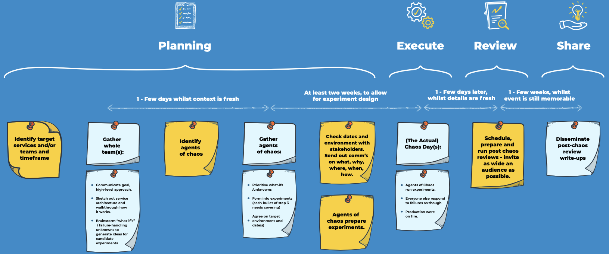

# Timeline

Whether you’re experimenting on a single service or at scale on an entire [digital platform](https://digital-platform.playbook.ee/), running a Chaos Day is an investment of time and energy that benefits from being mapped out. 

Whilst the process steps are the same regardless of scale, the organisational complexity, commitment and elapsed time increase with the number of services and teams involved. Because of this, our experience is to start small, so you can learn and adapt the process to your particular context. Pick one service or team to start with, not an entire engineering platform or group of teams, then incrementally grow with each subsequent Chaos Day.

The timeline below maps out the end-to-end process. The suggested elapsed time is based on experience running Chaos Days with few teams. If you’re scaling up to 5 or more teams, we’d recommend allowing 2-4 weeks for experiment design; other durations should be kept about the same.



John Lewis & Partners has 25 product teams, building 40 services on their [digital platform](https://medium.com/john-lewis-software-engineering/our-award-winning-john-lewis-digital-platform-2d093e03d542), which is built and run by two platform teams. There’s around 100 microservices, internal and external components, and downstream dependencies. As Digital Platform Enablement Lead, one of my goals was to help product teams deliver more resilient systems. Running a Chaos Day is a great way to foster an effective incident response, so I brought Lyndsay in to guide us through our first foray.  

We used a regular, cross-team, community session to introduce chaos engineering by presenting our experience of running Chaos Days in the public sector. This created an appetite within teams to learn more. For the inaugural Chaos Day, we had just one platform and one product team together. It was a [big success](https://medium.com/john-lewis-software-engineering/team-nimbus-and-the-agents-of-chaos-ab257e41fe36), with many lessons learned by the teams about their own systems plus chaos engineering itself. The participants shared these lessons out to all the other teams using their standard post-incident review process, followed by a presentation of key outcomes at their next cross-team community session.  

Starting small helped John Lewis & Partners learn and develop a repeatable, scalable approach that they are now replicating out to many more teams.




