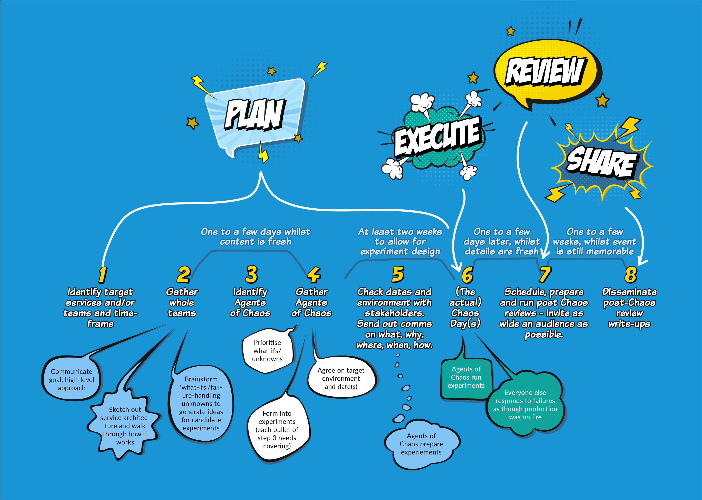

# Timeline

Whether you’re experimenting on a single service or at scale on an entire [digital platform](https://app.gitbook.com/o/-LotYsHXVKys1Z4wI\_dX/s/-MJRM-IVRZ9C6iJCPG9o/), planning your Chaos Day carefully is essential to make the most of your investment of time and energy.

Whilst the process is the same regardless of scale, the organisational complexity, commitment and elapsed time increase with the number of services and teams involved. Because of this, our advice is to start small, so you can learn and adapt the process to your particular situation. Start with one service or team , not an entire engineering platform, then grow incrementally with each subsequent Chaos Day.

The timeline below shows the end-to-end process. The suggested elapsed time is based on our experience running Chaos Days with a few teams. If you’re scaling up to five or more teams, we’d recommend allowing 2-4 weeks for experiment design; other durations can be kept about the same.



John Lewis & Partners has 25 product teams, building 40 services on their [digital platform](https://medium.com/john-lewis-software-engineering/our-award-winning-john-lewis-digital-platform-2d093e03d542), which is built and run by two platform teams. There are around 100 microservices, internal and external components, and downstream dependencies. As Digital Platform Enablement Lead, one of my goals was to help product teams to deliver more resilient systems. Running a Chaos Day is a great way to foster an effective incident response, so I brought Lyndsay in to guide us through our first foray.\

We used a regular, cross-team, community session to introduce chaos engineering and talk about our experience of running Chaos Days in the public sector. This created an appetite within teams to learn more. For the inaugural Chaos Day, we had just one platform and one product team. It was a [big success](https://medium.com/john-lewis-software-engineering/team-nimbus-and-the-agents-of-chaos-ab257e41fe36) and the teams learned many lessons about their own systems plus chaos engineering itself. Participants shared these lessons with other teams using their standard post-incident review process, followed by a presentation of key outcomes at their next cross-team community session.\

Starting small helped John Lewis & Partners learn and develop a repeatable, scalable approach that they are now replicating out to many more teams.

.jpeg>)


