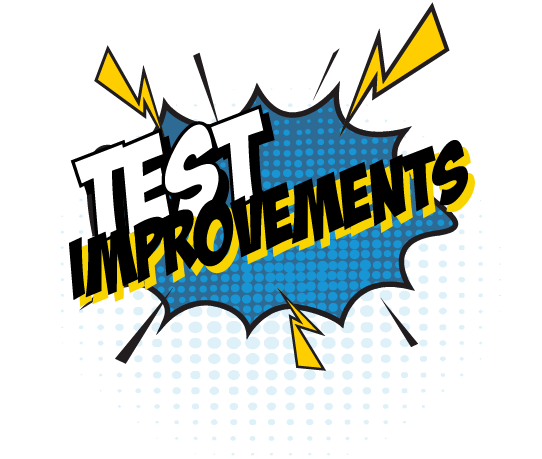

# What experiments to run on a Chaos Day

## Context

**It can be tempting to launch into chaos engineering with the desire to break things in diverse and spectacular ways, and see what happens.**&#x20;

This approach is definitely chaotic and may generate new insights, but is not the desired type of chaos and is likely to be a poor return on investment. To avoid this pitfall, remind yourself and the team why you’re doing chaos engineering: to improve system resilience through learning how the whole system (product, process, people) responds to injected failures.

Improved resilience comes through learning, and learning comes in many forms. For example, brainstorming experiments will help participants learn about the focal product’s architecture and characteristics, and this learning may get drawn upon in the next production incident, leading to reduced time to recover (measured over time, the Mean Time To Recover, MTTR, is one of the [four key indicators of software delivery performance](https://cloud.google.com/blog/products/devops-sre/using-the-four-keys-to-measure-your-devops-performance)). Experiments should therefore be identified, selected and designed to optimise for learning potential, instead of maximising inflicted damage, the number of remediation items identified, or how time to recover. Experiment themes Experiments take many forms and provide different types of lessons. Depending on the team’s context, it can be useful to group the experiments around a particular theme, or just aim for diversity. In running Chaos Days at various organisations we’ve seen the following themes emerge:

| .png>) | _Build confidence in the resilience of a service and the people and processes in place to operate it._ This theme can be used when a new service or major architectural change is being introduced, or ahead of an upcoming peak event (e.g. Cyber-5 in the case of an online retailer). It provides an indication to the owning and ancillary teams (e.g. operations or other support teams) and stakeholders that a service is resilient, appropriately understood and well supported. This theme is particularly useful for teams that have recently inherited a service or are new to the You Build It, You Run It model. To find out more see our [You Build It, You Run It playbook](https://you-build-it-you-run-it.playbook.ee/), by Steve Smith and Bethan Timmins. |
| ----------------------------------------------------------- | ---------------------------------------------------------------------------------------------------------------------------------------------------------------------------------------------------------------------------------------------------------------------------------------------------------------------------------------------------------------------------------------------------------------------------------------------------------------------------------------------------------------------------------------------------------------------------------------------------------------------------------------------------------------------------------------------------------------------------------------------------------------------------- |
| .png>)   | _Share knowledge and expertise across the team_ - Use to help new and existing team members fire-drill incident response in a safer setting than a real production-issue. This theme builds architectural and domain knowledge, familiarity with incident processes, observability tools and service runbooks. This is particularly useful to test  recent improvements to runbooks and/or telemetry (logging, metrics, alerting).                                                                                                                                                                                                                                                                                                                                           |
| .png>)  | _Shape a resilience backlog_ - Use to identify gaps in resilience mechanisms, observability, runbooks or team knowledge and to help prioritise what to invest in next.                                                                                                                                                                                                                                                                                                                                                                                                                                                                                                                                                                                                       |
|          | _Test out improvements to process and team knowledge_ - If your team has suffered one or more production incidents that went badly and remediations have been put in place, use this theme to recreate similar failures and discover what gaps still exist.                                                                                                                                                                                                                                                                                                                                                                                                                                                                                                                  |

__
